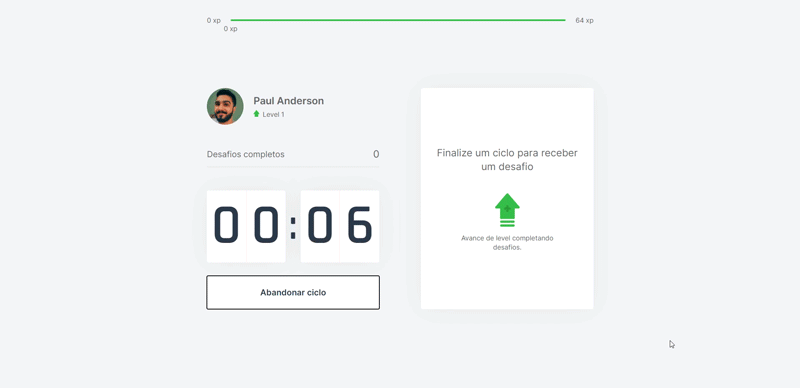

 
 
# projeto-react-next-exercitai
<h3>Aplicação com objetivo de incentivar o usuário a se exercitar ganhando level a cada etapa completada</h3>

Link do app: https://exercitai.vercel.app/

<h4>1. WINDOWS</h4>

Para que o app funcione perfeitamente em localhost você precisa ter configurado o ambiente de desenvolvimento.

<ol>
<li>Chocolatey;</li>
<li>Node.js 14 (LTS);</li>
<li>Yarn 1;</li>
<li>JDK 11 (LTS);</li>
</ol>

Fonte: https://react-native.rocketseat.dev/android/windows

<h4>2. CLONE<h4>

Após configurado o ambiente faça o clone e salve a pasta em um local de fácil acesso. Em seguida, abra a pasta dentro do Vscode de onde você salvou.

<h4>3. VSCODE</h4>

Para abrir o terminal no Visual Studio Segure cntrl + ' e digite: 'yarn dev' para iniciar o projeto.
Em seu navegador digite localhost:3000 para visualizar a aplicação. Enjoy!

